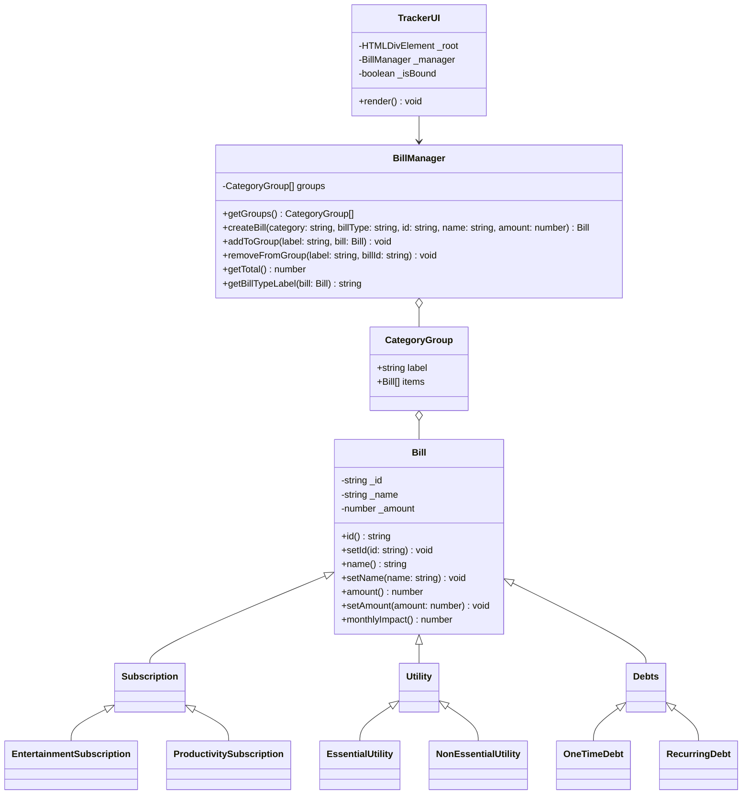

# Billy | Bill Tracker

Billy is a simple monthly bill tracker that lets you add bills by category (Subscriptions, Utilities, Debts), see per-category totals, and view the overall monthly expense at a glance. Entries are created via a form, grouped in cards, and can be removed with a single click.

## UML Diagram

